# Portal de Publicacion Multi-Red Social con IA

Sistema completo de gestion y publicacion automatizada en redes sociales utilizando inteligencia artificial (Google Gemini) para adaptar contenido a diferentes plataformas.

## Descripcion del Proyecto

Este proyecto es un portal web full-stack que permite crear una publicacion base y automaticamente adaptarla para 5 redes sociales diferentes (Facebook, Instagram, LinkedIn, WhatsApp y TikTok) utilizando IA. El sistema genera contenido optimizado para cada plataforma y permite publicar directamente desde la interfaz web.

### Caracteristicas Principales

- **Adaptacion Inteligente**: Utiliza Google Gemini para adaptar contenido segun las mejores practicas de cada red social.
- **Publicacion Automatizada**: Publica directamente en Facebook, Instagram, LinkedIn y WhatsApp.
- **Soporte Multimedia**: Carga de imagenes y videos para las publicaciones.
- **TikTok**: Soporte para carga y publicacion de videos (no generacion).
- **Preview y Edicion**: Revisa y edita las adaptaciones antes de publicar.
- **Dashboard Completo**: Visualiza historial, estadisticas y estado de publicaciones.
- **Manejo Robusto de Errores**: Sistema de reintentos con backoff exponencial.
- **Notificaciones**: Alertas de exito/error en consola con logging detallado.

## Arquitectura del Sistema

```mermaid
graph TB
    subgraph Frontend
        A[React App] --> B[Create Post Page]
        A --> C[Preview Page]
        A --> D[Dashboard]
    end
    
    subgraph Backend
        E[Django REST API] --> F[LLM Service]
        E --> G[Social Service]
        E --> H[Retry Service]
        E --> I[Notification Service]
        F --> J[Google Gemini API]
        G --> K[Facebook API]
        G --> L[Instagram API]
        G --> M[LinkedIn API]
        G --> N[WhatsApp/Twilio API]
    end
    
    subgraph Database
        O[(SQLite)]
    end
    
    A -->|HTTP Requests| E
    E -->|Store/Retrieve| O
    
    style A fill:#61dafb
    style E fill:#092e20
    style J fill:#4285f4
```



## Tecnologias Utilizadas

### Frontend
- **React 19**: Libreria UI
- **React Router 6**: Navegacion multi-pagina
- **Bootstrap 5**: Framework CSS
- **Axios**: Cliente HTTP
- **Vite**: Build tool y dev server

### Backend
- **Django 4.x**: Framework web
- **Django REST Framework**: API REST
- **Google Generative AI (Gemini)**: Adaptacion de contenido con IA
- **SQLite**: Base de datos
- **Requests**: Cliente HTTP para APIs externas

### APIs Externas
- Facebook Graph API v19.0
- Instagram Graph API
- LinkedIn API v2
- Twilio API (WhatsApp)
- Google Gemini API
- TikTok API v2

## Instalacion y Configuracion

### Prerrequisitos

- Python 3.8+
- Node.js 16+
- npm o yarn
- Cuentas y credenciales de API para:
  - Google Gemini
  - Facebook/Instagram Business
  - LinkedIn
  - Twilio (WhatsApp)
  - TikTok Developers

### 1. Clonar el Repositorio

```bash
git clone <repository-url>
cd "LLM Topicos"
```

### 2. Configurar Backend

```bash
cd backend

# Crear entorno virtual
python -m venv venv

# Activar entorno virtual
# Windows:
venv\Scripts\activate
# Linux/Mac:
source venv/bin/activate

# Instalar dependencias
pip install -r requirements.txt

# Crear archivo .env (ver seccion de Variables de Entorno)
# Copiar .env.example a .env y completar con tus credenciales

# Ejecutar migraciones
python manage.py makemigrations
python manage.py migrate

# Crear superusuario (opcional)
python manage.py createsuperuser
```

### 3. Configurar Frontend

```bash
cd ../frontend

# Instalar dependencias
npm install
```

## Variables de Entorno

Crea un archivo `.env` en la carpeta `backend/` con las siguientes variables:

```env
# Google Gemini API
GEMINI_API_KEY=tu_api_key_de_gemini

# Facebook/Instagram
FACEBOOK_PAGE_ID=tu_page_id
FACEBOOK_ACCESS_TOKEN=tu_access_token_de_larga_duracion
INSTAGRAM_ACCOUNT_ID=tu_instagram_business_account_id

# LinkedIn
LINKEDIN_ACCESS_TOKEN=tu_linkedin_access_token

# Twilio (WhatsApp)
TWILIO_ACCOUNT_SID=tu_twilio_account_sid
TWILIO_AUTH_TOKEN=tu_twilio_auth_token
TWILIO_WHATSAPP_FROM=whatsapp:+14155238886

# TikTok
TIKTOK_CLIENT_KEY=tu_client_key
TIKTOK_CLIENT_SECRET=tu_client_secret
TIKTOK_REDIRECT_URI=http://127.0.0.1:8000/api/tiktok/callback/
```

## Ejecutar el Proyecto

### Opcion 1: Desarrollo (Recomendado)

**Terminal 1 - Backend:**
```bash
cd backend
python manage.py runserver
```
El backend estara disponible en `http://localhost:8000`

**Terminal 2 - Frontend:**
```bash
cd frontend
npm run dev
```
El frontend estara disponible en `http://localhost:5173`

### Opcion 2: Produccion

**Backend:**
```bash
cd backend
python manage.py collectstatic
gunicorn backend.wsgi:application
```

**Frontend:**
```bash
cd frontend
npm run build
# Servir la carpeta dist/ con nginx o similar
```

## Despliegue en Render

### Backend (Web Service)
1. Conecta tu repositorio a Render.
2. Crea un nuevo **Web Service**.
3. **Build Command**: `pip install -r requirements.txt && python manage.py collectstatic --noinput && python manage.py migrate`
4. **Start Command**: `gunicorn backend.wsgi:application`
5. Agrega las variables de entorno en la seccion "Environment".
6. Asegurate de agregar `PYTHON_VERSION` (ej. 3.9.0).

### Frontend (Static Site)
1. Crea un nuevo **Static Site** en Render.
2. **Build Command**: `npm install && npm run build`
3. **Publish Directory**: `dist`
4. Agrega una regla de reescritura (Rewrite Rule) para SPA:
   - **Source**: `/*`
   - **Destination**: `/index.html`
   - **Action**: Rewrite

## Uso del Sistema

### 1. Crear Publicacion
1. Navega a la pagina principal.
2. Ingresa titulo y contenido base.
3. Agrega URL de imagen o sube un archivo (requerido para Instagram/TikTok).
4. Selecciona las redes sociales destino.
5. Haz clic en "Generar Preview".

### 2. Revisar y Editar
1. Revisa las adaptaciones generadas por IA.
2. Edita el contenido si es necesario.
3. Verifica los contadores de caracteres.
4. Para WhatsApp, ingresa el numero destino.

### 3. Publicar
- **Individual**: Publica en cada red individualmente.
- **Publicar Todo**: Usa este boton para publicar en todas a la vez.

### 4. Dashboard
- Visualiza todas las publicaciones.
- Filtra por estado, plataforma o fecha.
- Elimina publicaciones antiguas.
- Verifica estadisticas generales.

## Documentacion de API

Ver `docs/API.md` para documentacion completa de endpoints.

### Endpoints Principales

- `POST /api/adaptar/`: Generar adaptaciones con IA.
- `POST /api/publicar/`: Publicar en red social.
- `POST /api/upload/`: Subir archivos multimedia.
- `GET /api/posts/`: Listar todas las publicaciones.
- `GET /api/posts/<id>/`: Obtener publicacion especifica.
- `DELETE /api/posts/<id>/`: Eliminar publicacion.
- `GET /api/tiktok/auth/`: Iniciar flujo de autenticacion TikTok.

## Solucion de Problemas

### Error: "GEMINI_API_KEY no encontrada"
- Verifica que el archivo `.env` existe en `backend/`.
- Asegurate de que la variable esta correctamente escrita.
- Reinicia el servidor Django.

### Error: Instagram "Media not ready"
- El sistema espera 25 segundos automaticamente.
- Si persiste, verifica que la URL de imagen sea publica y accesible.

### Error: LinkedIn "Invalid token"
- Los tokens de LinkedIn expiran cada 60 dias.
- Regenera el token usando OAuth 2.0.

### Error: WhatsApp no envia mensajes a otros numeros
- **Causa**: Estas usando el **Twilio WhatsApp Sandbox**.
- **Solucion**: Los destinatarios deben unirse al sandbox enviando el codigo `join <tu-codigo>` al numero de Twilio.

## Testing

```bash
# Backend
cd backend
python manage.py test

# Frontend
cd frontend
npm run test
```

## Notas Importantes

### TikTok
Actualmente el sistema soporta la carga y publicacion de videos en formato .mp4. La generacion automatica de video mediante IA no esta implementada en esta version.

### WhatsApp Sandbox
El proyecto usa **Twilio WhatsApp Sandbox** por defecto. Solo permite enviar mensajes a numeros verificados. Para produccion, se requiere una cuenta Twilio Business.

### Limites de Caracteres
- Facebook: 500 caracteres
- Instagram: 2,200 caracteres
- LinkedIn: 3,000 caracteres
- WhatsApp: 300 caracteres
- TikTok: 2,200 caracteres

## Contribuciones

Las contribuciones son bienvenidas. Por favor:
1. Fork el proyecto.
2. Crea una rama para tu feature.
3. Commit tus cambios.
4. Push a la rama.
5. Abre un Pull Request.

## Licencia

Este proyecto es de codigo abierto y esta disponible bajo la licencia MIT.

## Autores

- Desarrollo inicial - [Tu Nombre]

## Agradecimientos

- Google Gemini por la API de IA.
- Meta por las APIs de Facebook e Instagram.
- LinkedIn por su API de publicacion.
- Twilio por la integracion de WhatsApp.
- TikTok por su API de publicacion.
